# Experiencing CI/CD with GitLab-CI and ArgoCD

This is a simple Python Flask web application. The app provides system information and a realtime monitoring screen with dials showing CPU, memory, IO and process information.

## Steps

- Build  a simple CI/CD pipeline for the Python Application.

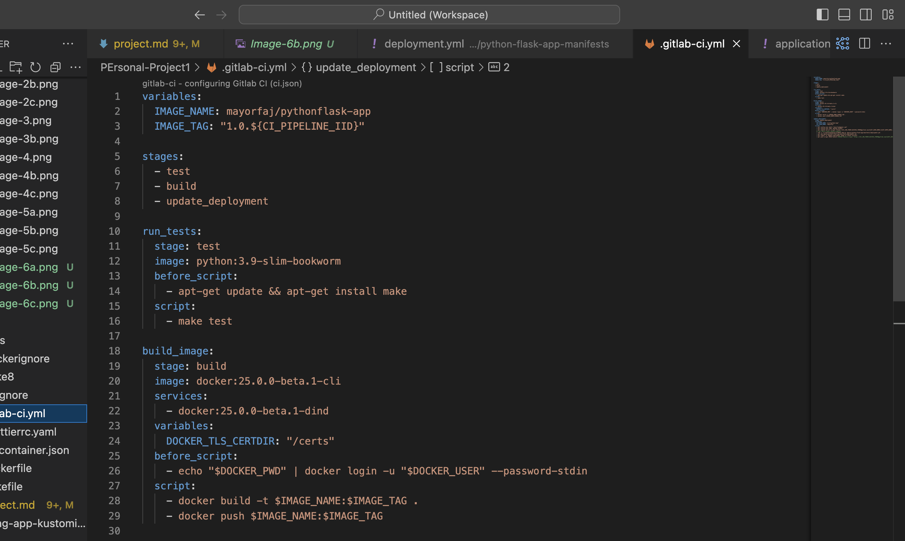

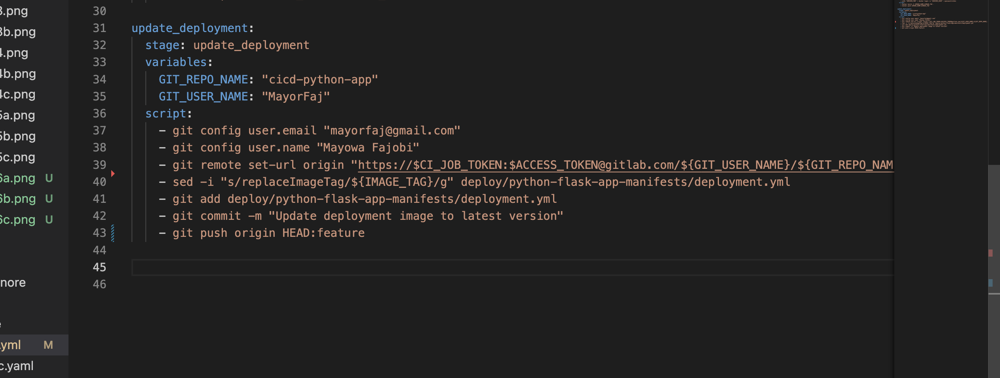

- Configure GitLab CI for contionous Integration, so the Argo CD automatically picks up the built docker image and run in your cluster.

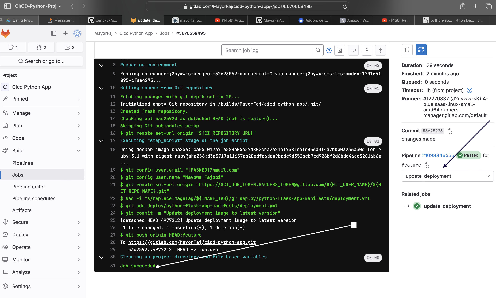

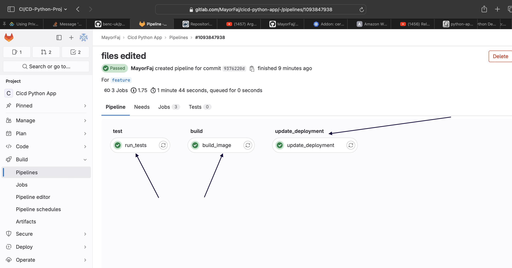

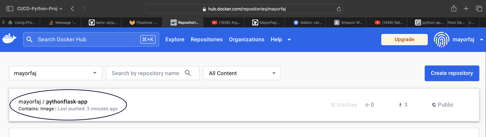

- Configure ArgoCD to connect to the Gitlab repository where the configuration files are hosted.

Let's begin

1. Build a Kubernetes cluster.

2. Deploy ArgoCD in the K8s cluster. (For this project, i am using minikube cluster)

```
kubectl create namespace argocd

kubectl apply -n argocd -f https://raw.githubusercontent.com/argoproj/argo-cd/stable/manifests/install.yaml
```

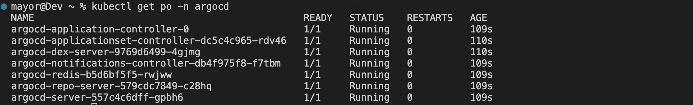

Access the argocd-server through the browser

```
kubectl edit service argocd-server -n argocd
```

```
minikube service argocd-server -n argocd 
```

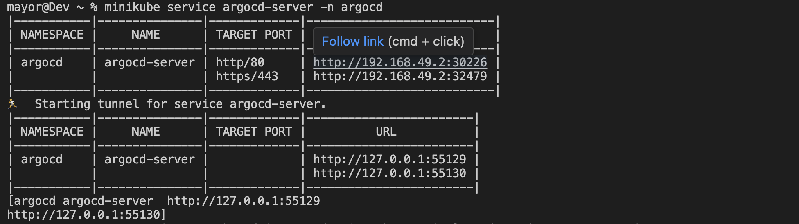

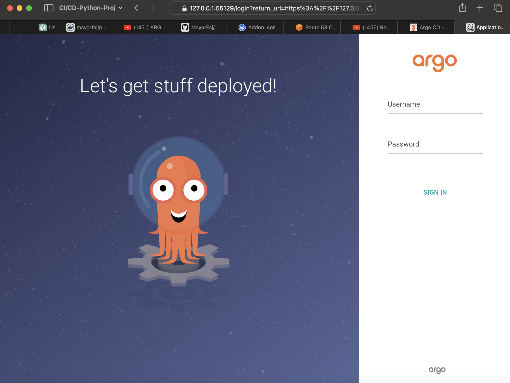

- Login with `admin` as username

- To get the password, run

```
kubectl get secret -n argocd
```

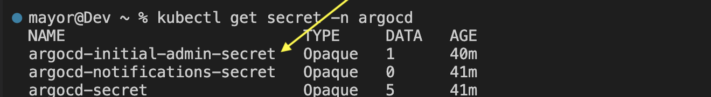

Run `kubectl edit secret argocd-initial-admin-secret -n argocd`.

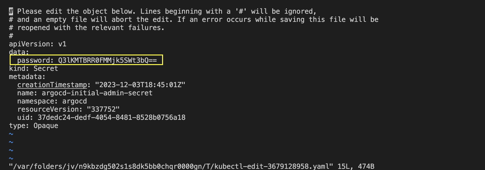

You will notice that the secret password is encrypted in base64. Copy the password and then decrypt it

```
echo Q3lKMTBRR0FMMjk5SWt3bQ== | base64 --decode
```

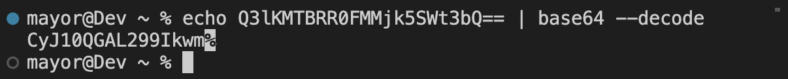

Ignore the **%** character, copy and paste the decripted password to log into argocd.

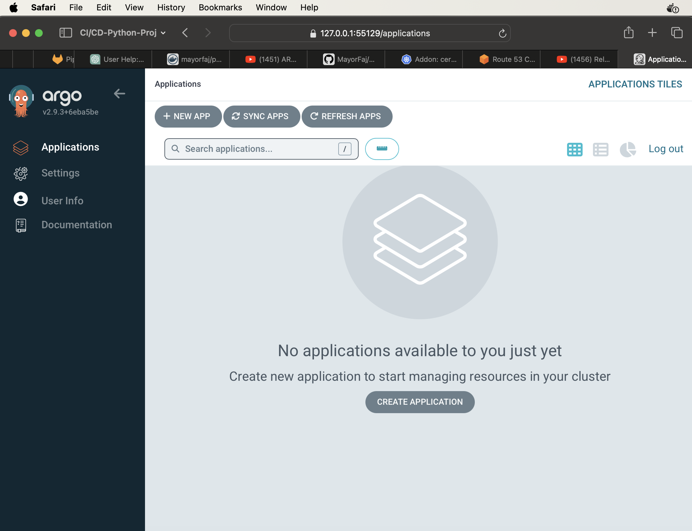

3. Write simple [yml manifest (deployment , service)](./deploy/python-flask-app-manifests/deployment.yml) to deploy the python-app, push the code to your repo.

4. Write a Configuration file for argo CD to connect it to the git repository where the configuration files are hosted. Refer to[application[](./deploy/application.yml).

- `cd` to the directory containing the application.yml and apply this in the cluster.

```
kubectl apply -f application.yml
```

- Head back to your argo-cd UI browser to confirm that the python applicatiion has been created.

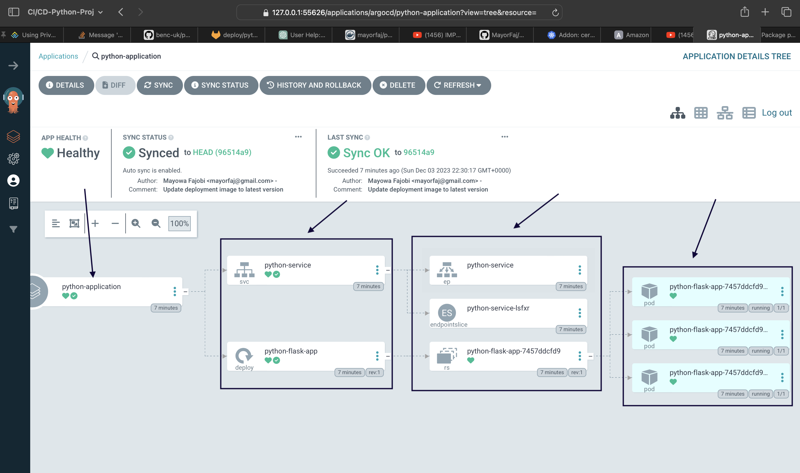

- Check that the pods are running as well

`kubectl get po -n tools`

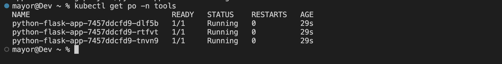

- Port forward to access the Python application from the browser

```
kubectl get svc
```

```
kubectl port-forward svc/python-service 8082:80
```

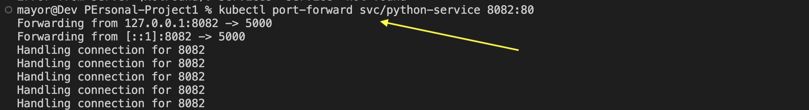

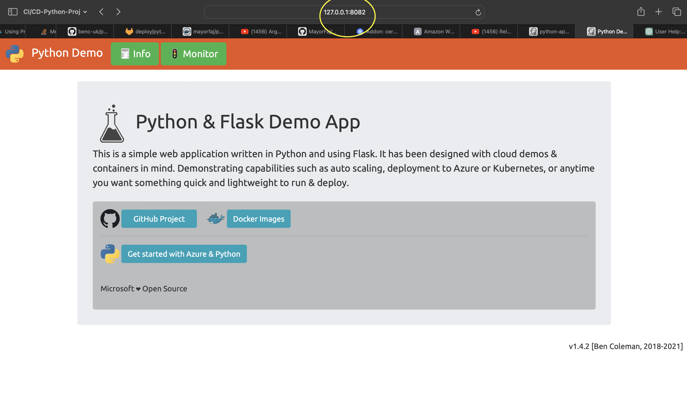

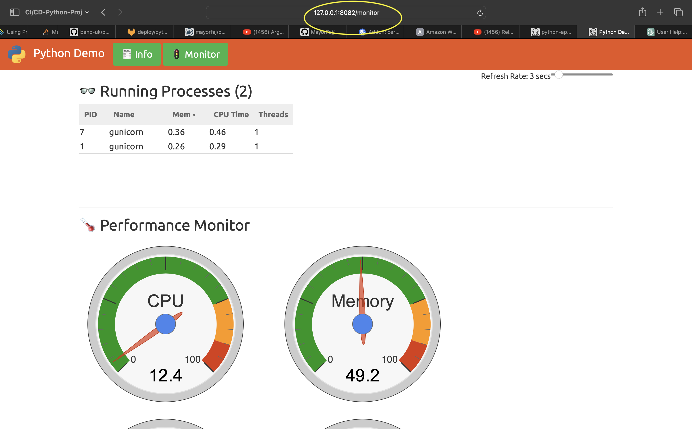

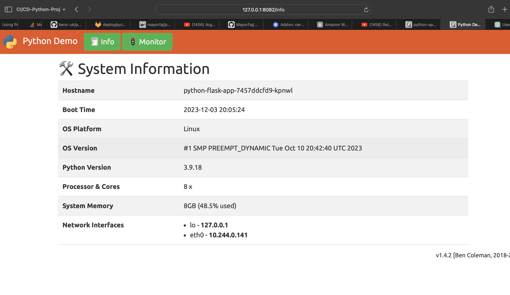
